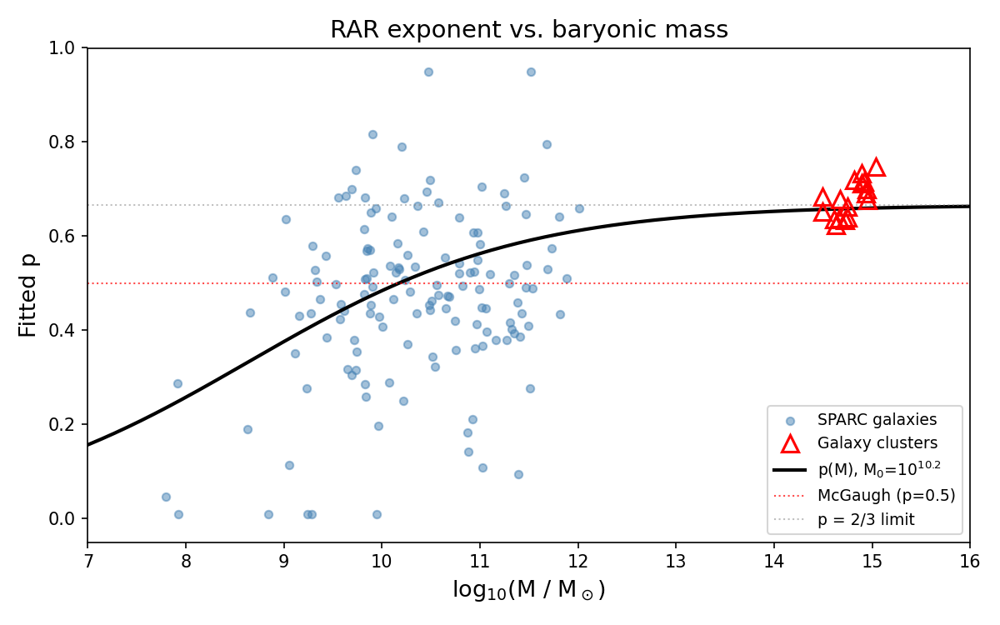
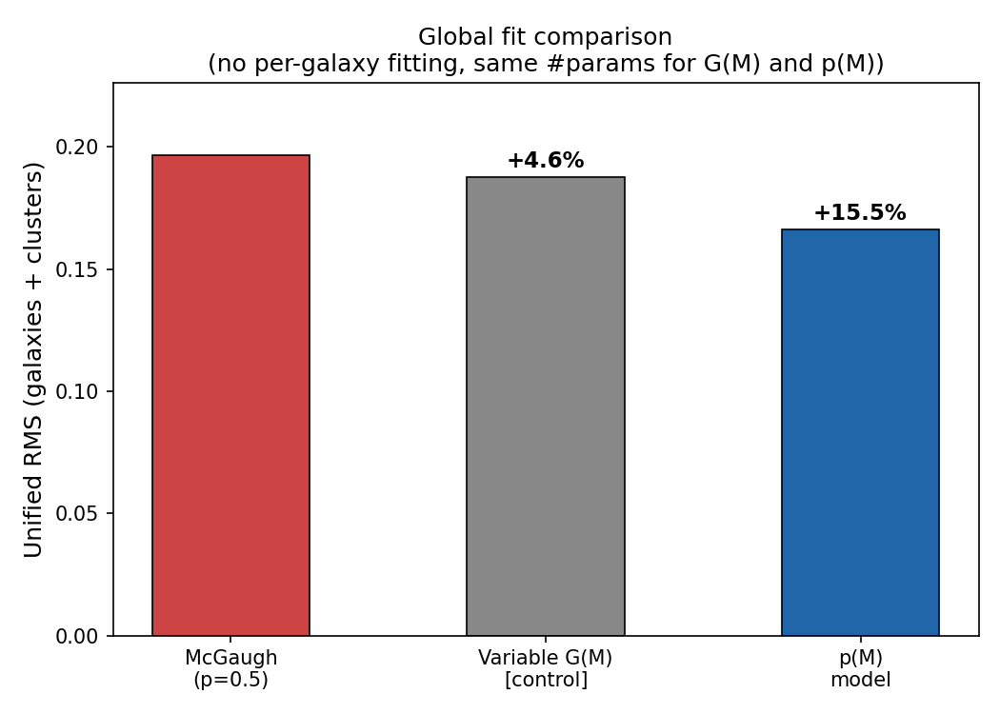

# Mass-Dependent Radial Acceleration Relation

**The exponent of the RAR interpolation function depends on system mass.**

This repository presents evidence that the Radial Acceleration Relation ([McGaugh, Lelli & Schombert 2016, PRL 117, 201101](https://doi.org/10.1103/PhysRevLett.117.201101)) is better described by an interpolation function whose exponent varies with the mass of the system:

```
mu(x, M) = 1 - exp(-x^p(M))

p(M) = 2u / (1 + 3u),   u = (M / M0)^(1/3)
```

where `x = g_bar / a0`, `M` is the system mass (see [mass definition note](#limitations)), and `M0 ~ 10^10.2 solar masses`.

For the standard McGaugh formula, `p = 0.5` for all systems. We find that `p` increases from ~0.2 for dwarf galaxies to ~0.66 for galaxy clusters, and a single formula describes both galaxy rotation curves and cluster mass discrepancies.





## Key Result

In a **global fit with no per-galaxy fitting** (single Y_disk for all galaxies):

| Model | Free params | RMS | vs McGaugh |
|-------|-------------|-----|------------|
| McGaugh (p = 0.5) | 1 | 0.197 | baseline |
| Constant p | 2 | 0.195 | +0.9% |
| Variable G(M) [control] | 3 | 0.188 | +4.6% |
| **p(M) model** | **3** | **0.166** | **+15.5%** |

The p(M) model improves over McGaugh by 15.5%, while a variable-G model (same number of parameters) only achieves 4.6%. The 11% difference disfavors Y_disk degeneracy as the source of the signal, though a definitive exclusion requires more gas-dominated dwarf galaxy data (see [Li+ 2021 bias test](#bias-test-li-2021) below).

The improvement comes from correcting a **mass-dependent systematic bias** in the standard RAR: MOND (p=0.5) systematically overpredicts g_obs for dwarf galaxies (mean bias = -0.42 dex at M < 10^9) and is approximately unbiased for massive galaxies. The correlation between MOND bias and mass is r = +0.46; p(M) reduces this to r = +0.11.

## Bias Test (Li+ 2021)

Li, Lelli, McGaugh, Schombert & Chae ([2021, A&A 646, L13](https://doi.org/10.1051/0004-6361/202040101)) showed that fitting a parameter per galaxy can create spurious mass dependence due to degeneracy with the stellar mass-to-light ratio Y_disk. We address this in three ways:

1. **Global fit (`run_global_fit.py`)**: No per-galaxy fitting at all. Single Y_disk shared by all galaxies. p(M) still improves by 15.5%, while the control model (variable G with same degrees of freedom) achieves only 4.6%. The 11% gap disfavors Y_disk degeneracy as the sole explanation.

2. **Bayesian marginalization (`run_bayesian_test.py`)**: Marginalizing over Y_disk ~ N(0.5, 0.15) and distance ~ N(1.0, 0.10), the per-galaxy p correlation with mass (r=0.18) exceeds the G_eff control (r=0.12). Suggestive but not definitive from galaxy data alone.

3. **Galaxy clusters are immune**: Cluster data involves no per-galaxy fitting and independently requires p ~ 0.66, far from the galaxy-optimal p ~ 0.5.

## Quick Start

```bash
pip install numpy scipy             # matplotlib also needed for make_figures.py
python run_global_fit.py            # Core result (no per-galaxy fitting, bias-free)
python run_main_analysis.py         # Detailed analysis (per-galaxy Y_disk, subject to Li+ caveat)
python run_little_things.py         # Independent validation on dwarf galaxies
python run_bayesian_test.py         # Li+ (2021) methodology check
python run_slope_test.py            # Rotation curve shape test (slope vs mass)
python run_loo_cv.py               # Leave-one-out cross-validation (slow)
```

## Data

- `data/sparc_data.mrt`: SPARC mass models for 175 disk galaxies (Lelli, McGaugh & Schombert 2016, AJ 152, 157)
- `data/little_things/finalrot/`: Rotation curves for 17 dwarf irregular galaxies (Iorio+ 2017, MNRAS 466, 4159)
- Galaxy cluster data from Vikhlinin+ 2006 (ApJ 640, 691) and X-COP/Ettori+ 2019 (A&A 621, A39), hardcoded in `sdhg/data.py`

## What This Is and Is Not

**This is**: An observational finding that the RAR interpolation exponent correlates with system mass, tested against methodological bias concerns.

**This is not**: A new theory of gravity, a claim about dark matter, or a peer-reviewed result.

## Limitations

- **Cross-validation is mixed**: Leave-one-out within SPARC gives +5.4% improvement (see below), confirming p(M) is not overfitting. However, applying SPARC-trained parameters to LITTLE THINGS gives -0.8%, suggesting limited generalization across datasets (possibly due to different mass estimation methods)
- **Rotation curve shapes are not independent evidence**: The outer slope of rotation curves correlates with mass (r = -0.62), but standard MOND (p=0.5) predicts this equally well (r = -0.63) from baryonic mass distributions alone. The p(M) improvement comes from the RAR *amplitude* (systematic offset), not the curve *shape*
- **Gas-dominated test is inconclusive**: In gas-dominated galaxies (where Y_disk is irrelevant), the MOND bias-mass correlation is r = +0.25 (N=24), suggestive but not statistically significant. We cannot fully rule out that the bias is caused by Y_disk systematics rather than gravitational physics
- M0 is uncertain by a factor of ~5 (10^10.0 to 10^10.8), depending on fitting method and cluster weighting
- The exponent 1/3 in the formula is approximate; the global fit gives alpha = 0.31 (6% below 1/3). A self-built 2+1D CDT simulation (with dynamic volume) gives gamma = 0.340 ± 0.025, consistent with 1/3 at 0.3σ
- **4D CDT connection is unresolved**: Ambjørn, Jurkiewicz & Loll ([2005, PRL 95, 171301](https://doi.org/10.1103/PhysRevLett.95.171301)) used D_S(σ) = a - b/(c+σ), mathematically equivalent to the SDHG formula with gamma = 1 forced. Fitting their data (σ = 40–400) with free gamma: RMS = 0.001 (gamma=1.0), 0.112 (gamma=1.5), 0.126 (gamma=0.5), 0.190 (gamma=0.25). The data clearly prefers gamma = 1. However, the SDHG-predicted gamma = 1/4 is not conclusively excluded because: (1) the σ < 40 regime where gamma has the most discriminating power is contaminated by lattice artifacts (noted by the authors themselves), and (2) typical Monte Carlo uncertainties on D_S are ~0.2–0.3, comparable to the RMS difference. Resolving this requires 4D CDT data at smaller σ with controlled systematics
- The functional form p(M) = 2u/(1+3u) is mathematically identical to the CDT spectral dimension formula d = dUV + (dIR-dUV)*u^γ/(1+u^γ). The 2+1D connection is numerically confirmed; the 4D connection is open
- Galaxy masses used in p(M) are dynamical proxies (M ~ 0.5 V_flat^2 R_last / G), not photometric baryonic masses. Using baryonic masses (from Vdisk, Vgas) reduces the improvement from 15.5% to 11.7% but the Li+ gap remains significant (6.7%). The optimal alpha shifts from 0.31 to 0.23, suggesting the relevant mass scale may be the total gravitational mass rather than baryonic mass alone
- Large-scale structure compatibility requires cosmological extension (not addressed here)
- **This work has not been peer-reviewed**

## Related Work

- Ambjørn, Jurkiewicz & Loll ([2005, PRL 95, 171301](https://doi.org/10.1103/PhysRevLett.95.171301)): Discovered spectral dimension flow from ~2 (UV) to ~4 (IR) in 4D CDT. See Limitations for detailed comparison with SDHG.
- Desmond, Hees & Famaey ([2024, MNRAS 530, 1781](https://doi.org/10.1093/mnras/stae955)): Parametrized the same exponent (as delta/2 in their delta-family) but fit it as a universal constant, not mass-dependent.
- EMOND — Zhao & Famaey (2012): Makes the acceleration scale a0 potential-dependent, not the exponent.
- Superfluid DM — Berezhiani & Khoury ([2015, PRD 92, 103510](https://doi.org/10.1103/PhysRevD.92.103510)): BEC phase transition could provide a physical mechanism for mass-dependent modification.
- [arXiv:2603.23591](https://arxiv.org/abs/2603.23591) (2026): Found that central galaxies in groups/clusters deviate from the standard RAR, with the divergence radius decreasing with host mass — independent evidence for mass-dependent RAR behavior.

## Cross-Validation

Leave-one-out cross-validation within SPARC (171 galaxies, `run_loo_cv.py`):

| Method | RMS | vs McGaugh |
|--------|-----|------------|
| McGaugh (p=0.5) | 0.197 | baseline |
| **p(M) LOO** | **0.186** | **+5.4%** |

The improvement is concentrated in dwarf galaxies (logM < 9: +30%), while massive galaxies show no improvement (-1.5%). This confirms that p(M) generalizes to unseen data and is not overfitting, but the effect is primarily relevant for low-mass systems.

## Disclaimer

This is an independent, exploratory research project by a non-academic individual. It has not been peer-reviewed or published in a scientific journal. Feedback, corrections, and independent verification are welcome via GitHub Issues.

## License

MIT. See [LICENSE](LICENSE).
