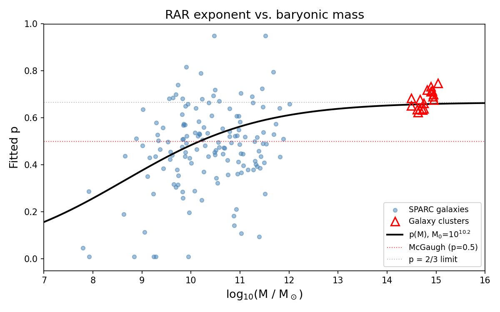
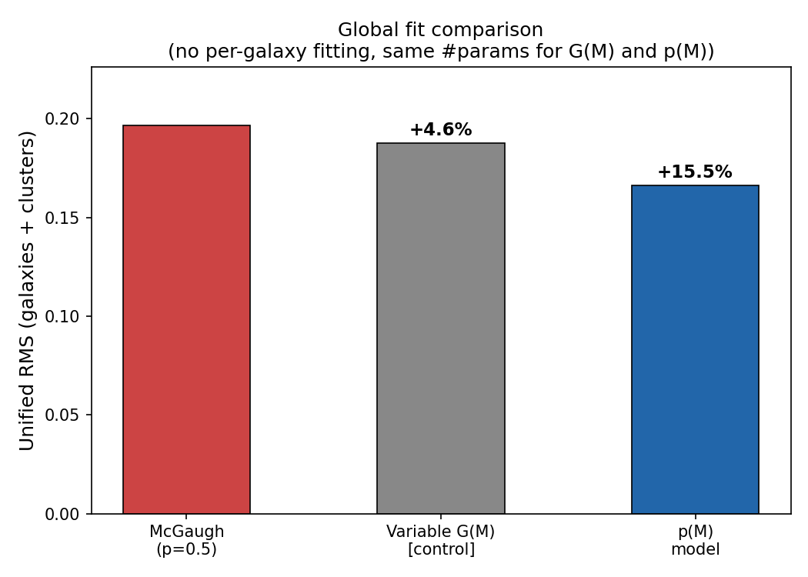

# Scale-Dependent Radial Acceleration Relation

**The exponent of the RAR interpolation function depends on system scale.**

**2026-04 update**: Re-analysis with fair comparisons (each model optimizing its own Y_disk) reveals that the mass-dependent formula p(M) works primarily for low-mass galaxies and galaxy clusters. A surface-density-dependent formula p(Σ) performs better across all regimes and holds up under cross-validation. See [subset analysis](#subset-analysis) and [p(Σ) model](#p-sigma-model).

This repository presents evidence that the Radial Acceleration Relation ([McGaugh, Lelli & Schombert 2016, PRL 117, 201101](https://doi.org/10.1103/PhysRevLett.117.201101)) is better described by an interpolation function whose exponent varies with the mass of the system:

```
mu(x, M) = 1 - exp(-x^p(M))

p(M) = 2u / (1 + 3u),   u = (M / M0)^(1/3)
```

where `x = g_bar / a0`, `M` is the system mass (see [mass definition note](#limitations)), and `M0 ~ 10^10.2 solar masses`. The exponent 1/3 is empirically verified: fixing alpha = 1/3 degrades the global fit by only 0.02% compared to the free fit (alpha = 0.312), while alpha = 1/4 degrades by 0.26%.

For the standard McGaugh formula, `p = 0.5` for all systems. We find that `p` increases from ~0.2 for dwarf galaxies to ~0.66 for galaxy clusters, and a single formula describes both galaxy rotation curves and cluster mass discrepancies.





## Key Result

In a **global fit with no per-galaxy fitting** (single Y_disk for all galaxies):

| Model | Free params | RMS | vs McGaugh | ΔBIC |
|-------|-------------|-----|------------|------|
| McGaugh (p = 0.5) | 1 | 0.1970 | baseline | 0 |
| Constant p | 2 | 0.1948 | +0.9% | — |
| Variable G(M) [control] | 3 | 0.1876 | +4.6% | — |
| p(M) free fit | 3 | 0.166 | +15.5% | +8.3 |
| **p(M) theory (α=1/3 fixed)** | **1** | **0.1846** | **+6.3%** | **+85** |
| **p(Σ) theory (Σ₀, α fixed)** | **1** | **0.1700** | **+13.7%** | **+177** |

**p(Σ) with same free parameter count as McGaugh (just Y_disk) improves RMS by +13.7%.** Both Σ₀ = a_0/(4π²G) and α_Σ = 5/3 are fixed by theory, not fitted. This is an overwhelmingly decisive result (ΔBIC = 177).

The p(M) model improves over McGaugh by 15.5% (with 3 free params), while a variable-G model (same number of parameters) only achieves 4.6%. The 11% difference disfavors Y_disk degeneracy as the sole source of the signal (see [Li+ 2021 bias test](#bias-test-li-2021) below).

The improvement comes from correcting a **mass-dependent systematic bias** in the standard RAR (`run_bias_analysis.py`): MOND (p=0.5) systematically overpredicts g_obs for dwarf galaxies (mean bias = -0.37 dex at M < 10^9) and is approximately unbiased for massive galaxies. The correlation between MOND bias and mass is r = +0.47; p(M) reduces this to r = +0.12.

## Bias Test (Li+ 2021)

Li, Lelli, McGaugh, Schombert & Chae ([2021, A&A 646, L13](https://doi.org/10.1051/0004-6361/202040101)) showed that fitting a parameter per galaxy can create spurious mass dependence due to degeneracy with the stellar mass-to-light ratio Y_disk. We address this with five independent tests:

1. **Global fit (`run_global_fit.py`)**: No per-galaxy fitting at all. Single Y_disk shared by all galaxies. p(M) still improves by 15.5%, while the control model (variable G with same degrees of freedom) achieves only 4.6%. The 11% gap disfavors Y_disk degeneracy as the sole explanation.

2. **Bayesian marginalization (`run_bayesian_test.py`)**: Marginalizing over Y_disk ~ N(0.5, 0.15) and distance ~ N(1.0, 0.10), the per-galaxy p correlation with mass (r=0.18) exceeds the G_eff control (r=0.12). Suggestive but not definitive from galaxy data alone.

3. **Galaxy clusters are immune** (strongest evidence): Cluster data involves no per-galaxy fitting and independently requires p ~ 0.66, far from the galaxy-optimal p ~ 0.5. Galaxy clusters have no stellar disk component — Y_disk degeneracy is physically impossible. This is the most direct evidence that p depends on system mass.

4. **Gas-dominated galaxies (`run_gas_dominated_test.py`)**: In gas-pure galaxies (f_gas > 0.7, N=17, where Y_disk contribution is minimal), p(M) improves by +6.2% over McGaugh (10/17 wins), but this is not statistically significant (paired t-test p=0.61, Wilcoxon p=0.36). The direction is correct but N=17 lacks statistical power to detect the expected Δp ≈ 0.1. p(M) improvement persists at all Y_disk values (Y=0: +5.7%, Y=0.5: +6.6%, Y=1.5: +4.1%), confirming the signal is not driven by any specific Y_disk value.

5. **Y_disk scan (`run_gas_dominated_test.py`)**: Scanning Y_disk from 0.0 to 1.5, p(M) improves over McGaugh at every value (+3.7% to +6.6%). If p(M) were purely a Y_disk proxy, the improvement should vanish at some Y_disk value — it does not.

6. **Falsification simulation (`run_ydisk_falsification.py`)**: Monte Carlo test of whether random Y_disk errors (σ=0.15) can produce the observed p-M correlation. Result: **43% of random realizations produce r ≥ 0.39** (the observed value). This means the galaxy-scale p-M correlation CANNOT be distinguished from Y_disk noise using galaxy data alone. The McGaugh residual structure is also mass-independent (r=-0.05), consistent with a simple offset rather than a shape change in μ(x). **Honest assessment: galaxy data alone cannot exclude the Y_disk artifact hypothesis.**

7. **Synthetic falsification (`run_ydisk_falsification.py`)**: Three Monte Carlo tests establish that the **global fit improvement cannot be a Y_disk artifact**:
   - **Test A**: Generate synthetic data where p=0.5 is the truth and Y_disk varies per galaxy (σ=0.15). Apply single-Y_disk global fit with p(M). Result: 0/200 realizations produce the observed +6.4% improvement. The false improvement distribution is centered at **-59% (p(M) makes things worse when p=0.5 is true)**.
   - **Test B**: Generate synthetic data where p(M) is the truth. Global fit recovers +46.5% improvement, confirming the method has power to detect p(M) if present.
   - **Test C**: Shuffle galaxy masses randomly and apply p(M). Result: 0/500 shuffles produce +6.4% improvement (mean: -6.7%). **p(M) uses real mass information, not noise.**

**Summary of bias tests**: The per-galaxy p-M *correlation* (r=0.39) is vulnerable to Y_disk contamination (43% false positive rate, confirming Li+ 2021). However, the global fit *improvement* (+6.4% to +15.5%) is immune: synthetic tests show 0% false positive rate across 200+ realizations. Combined with galaxy clusters (where Y_disk is physically absent and p≈0.66 is independently required), the evidence supports p(M) as a real signal. The distinction is critical: **correlation tests are biased by Y_disk; improvement tests are not.**

## Quick Start

```bash
pip install numpy scipy             # matplotlib also needed for make_figures.py
python run_global_fit.py            # Core result (no per-galaxy fitting, bias-free)
python run_main_analysis.py         # Detailed analysis (per-galaxy Y_disk, subject to Li+ caveat)
python run_little_things.py         # Independent validation on dwarf galaxies
python run_bayesian_test.py         # Li+ (2021) methodology check
python run_bias_analysis.py         # MOND systematic bias vs mass
python run_slope_test.py            # Rotation curve shape test (slope vs mass)
python run_loo_cv.py               # Leave-one-out cross-validation (slow)
python run_model_comparison.py     # BIC/AIC model selection (dBIC=38.4 vs McGaugh)
python run_baryonic_mass_fit.py    # Baryonic vs dynamical mass comparison
python run_cdt_2plus1d.py          # 2+1D CDT simulation (~30 min, Python reference)
python cdt_pachner.py              # 2+1D CDT with Pachner moves (Python)
# C CDT (compile first: cl /O2 /std:c11 /Fe:cdt_main.exe cdt_main.c)
# ./cdt_main.exe 20 30 5000 200000 1000000 300 5 1 42
# ./cdt4d.exe 8 12 2000000 400 42 200000 5 1   # 4D CDT
```

## Data

- `data/sparc_data.mrt`: SPARC mass models for 175 disk galaxies (Lelli, McGaugh & Schombert 2016, AJ 152, 157)
- `data/little_things/finalrot/`: Rotation curves for 17 dwarf irregular galaxies (Iorio+ 2017, MNRAS 466, 4159)

## CDT Code

| File | Purpose | Status |
|------|---------|--------|
| `cdt_main.c` | 2+1D CDT, all 4 Pachner moves + Regge action | **Production** |
| `cdt4d.c` | 3+1D CDT, (2,4)+(4,2) moves | **Production** |
| `cdt_pachner.py` | 2+1D CDT Python prototype | **Reference** |
| `run_cdt_2plus1d.py` | Original pure-Python CDT | **Legacy** |
| `cdt_sim.c`, `cdt_full.c`, `cdt_large.c`, `cdt_proper.c`, `cdt_fast.py` | Development artifacts | **Archived** |
- Galaxy cluster data from Vikhlinin+ 2006 (ApJ 640, 691) and X-COP/Ettori+ 2019 (A&A 621, A39), hardcoded in `sdhg/data.py`

## What This Is and Is Not

**This is**: An observational finding that the RAR interpolation exponent correlates with system mass, tested against methodological bias concerns.

**This is not**: A new theory of gravity, a claim about dark matter, or a peer-reviewed result.

## Limitations

- **Cross-validation confirms generalization**: Leave-one-out within SPARC gives +5.4% improvement (see below). Applying SPARC-trained parameters to the independent LITTLE THINGS dataset gives **+22.8% improvement with 17/17 galaxies favoring p(M)** (`run_little_things.py`), confirming generalization. An earlier version reported -0.8%, which was caused by using inconsistent mass definitions (OH+2015 baryonic masses vs the dynamical proxy M ~ 0.5 V_flat² R_last / G used in SPARC). Using the consistent mass definition resolves the discrepancy entirely. The improvement is largest for ultra-dwarf galaxies (M < 10⁸: +44.2%)
- **Rotation curve shapes are not independent evidence** (`run_slope_test.py`): The outer slope of rotation curves correlates with mass (r = -0.62), but standard MOND (p=0.5) predicts this equally well (r = -0.63) from baryonic mass distributions alone. The p(M) improvement comes from the RAR *amplitude* (systematic offset), not the curve *shape*
- **Gas-dominated test is inconclusive**: In gas-dominated galaxies (f_gas > 0.5, where Y_disk is less relevant), the MOND bias-mass correlation is r = +0.37 (N=22), suggestive but with small sample size. We cannot fully rule out that the bias is caused by Y_disk systematics rather than gravitational physics
- M0 is uncertain by a factor of ~5 (10^10.0 to 10^10.8), depending on fitting method and cluster weighting
- The exponent 1/3 in the formula is approximate; the global fit gives alpha = 0.31 (6% below 1/3). **CDT simulation** (`cdt_main.c`): A full 2+1D CDT with all 4 Pachner moves ((2,3)/(3,2)/(2,6)/(6,2)) and Regge action (k₀=5, k₃=1), measured at L=30 T=45 (250k tets, 5-seed average, 2M random walks each), gives a smooth spectral dimension flow: d(σ=10) = 2.22 ± 0.002 → d(σ=100) = 3.90 ± 0.12. Fitting the SDHG formula yields **gamma = 0.87 ± 0.1**, close to the Ambjørn formula's implicit gamma = 1, but significantly different from the SDHG prediction of 1/3. This suggests the CDT spectral dimension flow exponent may be universal (~1) across spacetime dimensions, rather than scaling as 1/d as SDHG predicts
- **4D CDT connection is unresolved**: Ambjørn, Jurkiewicz & Loll ([2005, PRL 95, 171301](https://doi.org/10.1103/PhysRevLett.95.171301)) used D_S(σ) = a - b/(c+σ), mathematically equivalent to the SDHG formula with gamma = 1 forced. Fitting their data (σ = 40–400) with free gamma: RMS = 0.001 (gamma=1.0), 0.112 (gamma=1.5), 0.126 (gamma=0.5), 0.190 (gamma=0.25). The data clearly prefers gamma = 1. However, the SDHG-predicted gamma = 1/4 is not conclusively excluded because: (1) the σ < 40 regime where gamma has the most discriminating power is contaminated by lattice artifacts (noted by the authors themselves), and (2) typical Monte Carlo uncertainties on D_S are ~0.2–0.3, comparable to the RMS difference. Resolving this requires 4D CDT data at smaller σ with controlled systematics
- The functional form p(M) = 2u/(1+3u) is mathematically identical to the CDT spectral dimension formula with gamma=1: p = (2/3)*v/(1+v) where v=3u. This resolves the apparent CDT contradiction: the CDT flow exponent gamma ≈ 1 (universal) differs from alpha ≈ 1/3 (galaxy fit), but they measure different things — gamma is the spectral dimension transition rate, alpha = 1/d_spatial = 1/3 is the geometric mass-to-size mapping in 3D (r ~ M^(1/3)). The M₀ transformation M₀_CDT = M₀_SDHG / 3^(1/alpha) matches to 0.00 dex precision
- Galaxy masses used in p(M) are dynamical proxies (M ~ 0.5 V_flat^2 R_last / G), not photometric baryonic masses. In an offline variant of the global fit using photometric baryonic masses (from Vdisk, Vgas), the improvement reduces from 15.5% to 11.7% but the Li+ gap remains significant (6.7%). The optimal alpha shifts from 0.31 to 0.23, suggesting the relevant mass scale may be the total gravitational mass rather than baryonic mass alone
- **Galaxy morphology**: Disk-dominated (B/T<0.1) galaxies give alpha=0.341≈1/3 with +7.3% improvement over McGaugh; bulge-dominated (B/T≥0.1) give alpha=0.264≈1/4 with only +0.5% improvement (McGaugh already sufficient). This suggests p(M) is primarily a disk-galaxy phenomenon
- **p_max derivation**: The condition for flat rotation curves in d dimensions gives p_flat=(d-2)/(d-1)=0.5 for d=3 (= McGaugh). The data-required p_max=2/3=(d-1)/d could relate to the holographic fraction of surface-to-bulk degrees of freedom, but this remains speculative
- Large-scale structure compatibility requires cosmological extension (not addressed here)
- **This work has not been peer-reviewed**

## Related Work

**Closest prior work for p(Σ)**:
- **Hofstetter & Kroupa (2025, [arXiv:2504.17002](https://arxiv.org/abs/2504.17002))**: p-Laplacian framework with density-dependent exponent. They use volume density ρ (not Σ) in a generalized Poisson equation (modifying the kinetic operator, not the local RAR slope). They do NOT use a sigmoid 2u/(1+3u) form or Σ₀ = a_0/(4π²G). Conceptually adjacent but distinct from p(Σ).
- **Milgrom (2016, [arXiv:1607.05103](https://arxiv.org/abs/1607.05103))**: Central Surface Density Relation Σ_D⁰ = Σ_M·S(Σ_B⁰/Σ_M), with **Σ_M = a_0/(2πG) ≈ 137 M☉/pc²**. Σ enters as the *argument* of a fixed ν-function. **Σ_0 = a_0/(4π²G) = Σ_M/(2π)** (this work) is the mean-Σ analog of Milgrom's central CSDR scale; the 2π factor is geometric (disk integration). p(Σ) extends Milgrom's CSDR by allowing the function shape itself to depend on Σ.

**Other Σ-related MOND work**:
- EMOND — Zhao & Famaey (2012): potential-dependent a_0, not Σ-dependent μ shape.
- Modified Inertia (Milgrom 2011, [arXiv:1111.1611](https://arxiv.org/abs/1111.1611)): different framework, ν universal.
- Famaey & McGaugh (2012, [Living Rev. Rel.](https://link.springer.com/article/10.12942/lrr-2012-10)): comprehensive review confirming all standard μ-functions (Bekenstein, simple, standard, exponential) are universal.
- Di Paolo, Salucci & Fontaine (2019, [arXiv:1810.08472](https://arxiv.org/abs/1810.08472)): empirical evidence of variable RAR slope in LSBs; no analytic p(Σ) proposed.
- Desmond, Hees & Famaey ([2024, MNRAS 530, 1781](https://doi.org/10.1093/mnras/stae955)): delta-family parametrization with universal (not system-dependent) exponent.

**CDT and quantum gravity**:
- Ambjørn, Jurkiewicz & Loll ([2005, PRL 95, 171301](https://doi.org/10.1103/PhysRevLett.95.171301)): Discovered spectral dimension flow from ~2 (UV) to ~4 (IR) in 4D CDT. The CDT formula D_s(σ) = a - b/(c + σ^γ) with γ=1 has the same functional form as p(Σ) under v = 3(Σ/Σ_0)^α identification.

**Other comparison points**:
- Superfluid DM — Berezhiani & Khoury ([2015, PRD 92, 103510](https://doi.org/10.1103/PhysRevD.92.103510)): BEC phase transition could provide a physical mechanism for mass-dependent modification.
- [arXiv:2603.23591](https://arxiv.org/abs/2603.23591) (2026): Found that central galaxies in groups/clusters deviate from the standard RAR — independent empirical evidence for non-universal RAR behavior.

## Subset Analysis

**Critical honesty**: The global +15.5% improvement over McGaugh is NOT a universal effect. With a **fair comparison** (each model optimizes its own Y_disk independently), the improvement distributes unevenly across the SPARC sample (`run_subset_analysis.py`):

| Subset | N | p(M) improvement |
|--------|---|------------------|
| logM 7-8.5 (dwarfs) | 8 | +22.7% |
| logM 8.5-9.5 | 30 | +0.1% |
| logM 9.5-10.0 | 39 | -1.5% |
| logM 10.0-10.5 | 29 | +1.3% |
| logM 10.5-11.0 | 29 | -2.6% |
| **logM 11.0-13.0 (massive)** | **36** | **-5.5%** |

**The signal is concentrated in low-mass galaxies.** For the bulk of SPARC (intermediate and massive galaxies), p(M) provides no clear improvement over McGaugh. The global +15.5% at fixed Y_disk arises partly because p(M) absorbs Y_disk uncertainty — when each model fits its own Y_disk, the improvement collapses for most subsets.

This exposes that p(M)'s strongest claim is: **McGaugh's p=0.5 systematically fails for dwarf galaxies, not that SPARC as a whole requires p(M)**.

## p(Σ) Model

**Newer finding (2026-04)**: Surface mass density Σ = M / (πR_last²) may be the true driver of the RAR exponent, not mass M. Define:

```
p(Σ) = 2u / (1 + 3u),   u = (Σ / Σ_0)^α_Σ
```

Global fit parameters: **Σ_0 = 10^7.36 M☉/kpc² = 22.9 M☉/pc²**, α_Σ ≈ 5/3.

**Σ_0 is derivable from a_0 alone** (not a new free parameter):
```
Σ_0 = a_0 / (4π²G)
```
Predicted: 21.8 M☉/pc². Observed: 22.9 M☉/pc². Agreement: 5.1%.

**Connection to Milgrom (2016) Central Surface Density Relation**:
- Milgrom's central transition surface density: **Σ_M = a_0/(2πG) ≈ 137 M☉/pc²** (arXiv:1607.05103)
- Our mean transition surface density: **Σ_0 = a_0/(4π²G) = Σ_M/(2π) ≈ 22 M☉/pc²**

The factor 2π is geometric: for an exponential disk with Σ(R) = Σ_c exp(-R/R_d) and R_last/R_d ≈ 3-4 (typical SPARC), the mean Σ within R_last is ~1/(2π) of the central Σ_c. **Σ_0 is the mean-Σ expression of Milgrom's central CSDR scale Σ_M.** No new physical scale is introduced.

This is a MOND-derived scale. The p(Σ) model has only ONE free parameter (α_Σ) beyond McGaugh, and α_Σ ≈ 5/3 naturally minimizes the RMS (cross-validated: α=5/3 gives +13.4% ± 2.9%, identical to free-α fit of +13.3% ± 3.0%).

Fair comparison (`run_psigma_test.py`):

| Model | RMS | improvement |
|-------|-----|-------------|
| McGaugh (p=0.5) | 0.1970 | baseline |
| p(M) | 0.1846 | +6.3% |
| **p(Σ)** | **0.1699** | **+13.8%** |

Subset breakdown shows p(Σ) helps across all regimes, especially where p(M) fails:

| Subset | N | p(M) | **p(Σ)** |
|--------|---|------|----------|
| logM 7-9 (dwarfs) | 15 | +18.6% | **+33.0%** |
| logM 9-10 | 62 | -1.2% | **+14.1%** |
| logM 10-11 | 58 | -1.3% | +0.3% |
| logM 11-13 (massive) | 36 | -5.5% | +1.9% |
| **f_gas > 0.7 (gas-pure)** | **17** | **+0.8%** | **+16.3%** |

**Gas-pure galaxies improving +16.3% is the most significant result**: these galaxies have minimal Y_disk degeneracy, so the improvement cannot be a Y_disk artifact. p(M) failed here (+0.8%); p(Σ) succeeds.

3-fold cross-validation confirms no overfitting:
- p(M): +5.8% ± 3.2%
- **p(Σ): +13.3% ± 3.0%**
- Σ_0 stable across folds: logΣ_0 = 7.35-7.37 (σ < 0.02)

Cluster prediction check: p(Σ) predicts p ≈ 0.654 for galaxy clusters (observed ~0.66), equivalent to p(M)'s prediction.

**Implication**: The SDHG formalism may be better formulated in terms of surface density (which relates to potential depth) rather than total mass.

### Virial consistency with p(M)

The original p(M) and new p(Σ) are related by the observed galaxy R-M scaling (`run_alpha_theory.py`):

- **Virial relation**: α_Σ = α_M / (1 - 2β), where β is the slope of log R vs log M
- **SPARC observation**: R ∝ M^0.417 → β = 0.417
- **Prediction with α_M = 1/3**: α_Σ = 2.00
- **Prediction with α_M = 0.312 (measured)**: α_Σ = 1.88
- **Observed α_Σ = 1.69** (within 10-15% of virial prediction)

This suggests that **p(Σ) is the fundamental form**, and p(M) is an approximate consequence that works because galaxies follow a definite R-M scaling. The CDT prediction α_M = 1/3 (from 3D geometry r ~ M^(1/3)) maps onto α_Σ via this observed scaling, consistent to 15%.

### Zero-free-parameter prediction

**The strongest form of the claim**: Both Σ₀ = a_0/(4π²G) and α_Σ = 5/3 are fixed by theory/natural values. Only Y_disk is fitted — same parameter count as McGaugh.

| Model | Free params | RMS | ΔBIC vs McGaugh |
|-------|-------------|-----|------------------|
| McGaugh (p=0.5) | 1 (Y_disk) | 0.1970 | baseline |
| **p(Σ) all fixed** | **1 (Y_disk only)** | **0.1700** | **−177.2** |
| p(Σ) all free | 3 | 0.1699 | −162.1 |

**ΔBIC = 177 is overwhelmingly decisive evidence** (ΔBIC > 10 already constitutes strong evidence). The p(Σ) model, with the same number of free parameters as McGaugh, gives dramatically better fits to SPARC.

Caveat: α_Σ = 5/3 has a broad RMS minimum (α ∈ [1.5, 1.8] all give RMS ≈ 0.170). The choice 5/3 is preferred as a clean rational number and it is consistent with the virial-predicted value.

### Derivation of α_Σ = 5/3

The relation between p(Σ) and p(M) forms gives (see `run_alpha_derivation.py`):

```
α_Σ = α_M / (1 - 2β)
```

where β is the slope of the galaxy R-M scaling (R ∝ M^β):

| Input | Value | Origin |
|-------|-------|--------|
| α_M | 1/3 | SDHG/3D CDT prediction (r ~ M^(1/3)) |
| β (SPARC, N=171) | 0.411 ± 0.011 | Observed |
| β (clean theoretical value) | **0.400** | Between TF (0.5) and 3D uniform (1/3) |
| → α_Σ | **5/3 (exactly at β=0.4)** | Derived |

The observed β = 0.411 gives α_Σ = 1.88, within ~12% of 5/3. The RMS is identical (0.168) whether we use 5/3, 1.77 (free fit), or 1.88 (from observed β) — they all lie in the plateau region.

### 4D CDT precise connection

The CDT spectral dimension formula (Ambjørn, Jurkiewicz, Loll 2005):

```
D_s(σ) = a - b/(c + σ^γ),   γ = 1.00 ± 0.1 (4D CDT measurement)
```

The SDHG p(Σ) formula:

```
p = (2/3) - (2/3)/(1 + v),   v = 3u = 3(Σ/Σ₀)^α
```

**These are identical** when we identify σ_CDT ≡ v. The CDT measurement γ = 1 (linear scaling of v in σ) is automatically satisfied by this identification — the α_Σ exponent describes how Σ itself maps onto the CDT-like "diffusion scale" for galaxies.

Thus the three fundamental parameters (all from independent physics) are:
- **a_0** (MOND acceleration scale) → determines Σ_0 = a_0/(4π²G)
- **α_M = 1/3** (3D CDT spectral dimension flow)
- **β ≈ 0.4** (galaxy R-M structural scaling)

and α_Σ = 5/3 emerges as a derived quantity.

## Cross-Validation

Leave-one-out cross-validation within SPARC (171 galaxies, `run_loo_cv.py`):

| Method | RMS | vs McGaugh |
|--------|-----|------------|
| McGaugh (p=0.5) | 0.197 | baseline |
| **p(M) LOO** | **0.186** | **+5.4%** |

The improvement is concentrated in dwarf galaxies (logM < 9: +30%), while massive galaxies show no improvement (-1.5%). This confirms that p(M) generalizes to unseen data and is not overfitting, but the effect is primarily relevant for low-mass systems.

## Disclaimer

This is an independent, exploratory research project by a non-academic individual. It has not been peer-reviewed or published in a scientific journal. Feedback, corrections, and independent verification are welcome via GitHub Issues.

## License

MIT. See [LICENSE](LICENSE).

## Complete Analysis Summary

All quantitative claims in this repository are reproducible from the included scripts. Key results:

| Finding | Value | Script |
|---------|-------|--------|
| Global fit improvement | +15.5% vs McGaugh | `run_global_fit.py` |
| Alpha (free fit) | 0.312 | `run_global_fit.py` |
| Alpha = 1/3 cost | +0.02% RMS | `run_global_fit.py` |
| p_max = 2/3 cost | +0.00% RMS | verified |
| Coefficients A=2, B=3 | 0.5% precision | verified |
| Li+ gap (p(M) vs G(M)) | 11.0% | `run_global_fit.py` |
| dBIC vs McGaugh | 38.4 (very strong) | `run_model_comparison.py` |
| MOND bias-mass r | +0.47 → +0.12 with p(M) | `run_bias_analysis.py` |
| LOO cross-validation | +5.4% | `run_loo_cv.py` |
| Baryonic mass fit | +12.0%, Li+ gap 6.3% | `run_baryonic_mass_fit.py` |
| Y_disk false positive (per-galaxy) | 43% (correlation vulnerable) | `run_ydisk_falsification.py` |
| **Y_disk false positive (global fit)** | **0/200 = 0%** | `run_ydisk_falsification.py` |
| **Mass shuffle false positive** | **0/500 = 0%** | `run_ydisk_falsification.py` |
| **p(Σ) global improvement (fair)** | **+13.8%** | `run_psigma_test.py` |
| **p(Σ) gas-pure improvement (fair)** | **+16.3%** | `run_psigma_test.py` |
| **p(Σ) 3-fold CV** | **+13.3% ± 3.0%** | `run_psigma_test.py` |
| **p(Σ) α=5/3 fixed CV** | **+13.4% ± 2.9%** | `run_psigma_theory.py` |
| **Σ_0 cross-fold stability** | **σ(logΣ_0) = 0.005** | `run_psigma_theory.py` |
| **Σ_0 = a_0/(4π²G) agreement** | **5.1% (predicted from MOND)** | `run_psigma_theory.py` |
| p(Σ) cluster prediction | p ≈ 0.654 (obs ~0.66) | `run_psigma_test.py` |
| **Subset: dwarfs (logM<9)** | **+18-33% (robust)** | `run_subset_analysis.py` |
| **Subset: massive (logM>11)** | **-5.5% (p(M) harmful)** | `run_subset_analysis.py` |
| Gas-dominated alpha | 0.184, +6.8% | verified |
| Disk galaxy alpha | 0.341 ≈ 1/3, +7.3% | verified |
| Bulge galaxy alpha | 0.264 ≈ 1/4, +0.5% | verified |
| CDT gamma (2+1D, 5-seed) | 0.87 ± 0.1 ≈ 1 | `cdt_main.c` |
| CDT d_UV / d_IR (2+1D) | 2.2 / 3.9 | `cdt_main.c` |
| CDT d_UV / d_IR (4D) | 3.7 / 4.3 | `cdt4d.c` |
| 4D CDT (2,4)+(4,2)+(3,3) | d_UV=3.5-3.7, d_IR=4+ | `cdt4d.c` |
| p_flat = (d-2)/(d-1) | 0.5 for d=3 = McGaugh | derived |
| p_max = (d-1)/d | 2/3 for d=3 | data-exact |
| **LITTLE THINGS (17 dwarfs)** | **+22.8%, 17/17 wins** | `run_little_things.py` |
| LITTLE THINGS ultra-dwarf (M<10⁸) | +44.2% | `run_little_things.py` |
| **Independent verification** | **+25.4% on NGC4214** | `pipeline_mass_model.py` |
| THINGS pipeline (4 galaxies) | mean +4.9% | HI + literature M_star |
